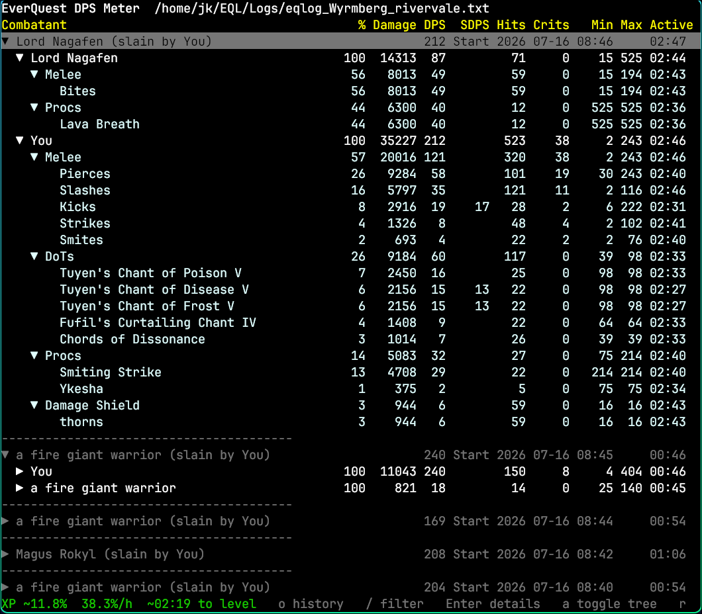

# eqdps

`eqdps` is a terminal DPS meter for EverQuest log files.

It tails an EQ log, tracks every engaged mob independently, and shows per-mob
damage in a live terminal UI. It can also replay recent log history to compare
parses or debug combat detection.

`Because I am lazy and wanted to play EverQuest Legends Open Beta, Codex did most of the work.`



## Features

- Live EverQuest log tailing
- Concurrent active-mob and completed-mob history display
- Independent mob endings from death, player death, and idle timeout
- Player, pet, mob, spell, proc, DoT, and damage shield parsing
- Per-mob combatant rows with DPS/SDPS, hits, crits, min/max, and active time
- Session XP percentage and XP/hour with long pauses excluded
- Expandable details grouped by melee, cast magic, proc, DoT, and shield
- Adaptive table widths for narrow terminals
- In-app history reload menu
- Plain text output mode for comparisons

## Install

```bash
go install github.com/uija/eqdps@latest
```

Or build from a local checkout:

```bash
git clone https://github.com/uija/eqdps.git
cd eqdps
go build .
```

## Usage

Run the live TUI:

```bash
eqdps /path/to/eqlog_character_server.txt
```

From a local checkout:

```bash
go run . /path/to/eqlog_character_server.txt
```

By default, combat live mode starts at the current end of the log file and only
parses new combat lines written after startup. Once Plane of Sky tracking is
enabled, its character state resumes from its saved logfile offset and catches
up missed loot and turn-ins before following live lines.

## Hotkeys

| Key | Action |
| --- | --- |
| `o` | Open history menu, including a full-log replay |
| `p` | Open the Plane of Sky quest tracker |
| `/` | Filter the displayed fights by mob name |
| `Enter` | Expand/collapse a mob, combatant, or detail category |
| `a` | Fully expand or collapse the selected subtree |
| `r` | Reset the combat and session XP meters and start fresh |
| `q` / `Esc` | Quit |

## History And Replay

The in-app history menu offers Now, 1h, 4h, 8h, 1d, and Full. After loading
history, press `/` and enter a case-insensitive mob-name substring to compare
matching fights. Submit an empty filter to show every fight again.

Seed the TUI with recent history before continuing live:

```bash
eqdps --back=30 /path/to/log.txt
```

Parse from an exact log timestamp:

```bash
eqdps --since "2026-07-06 19:22" /path/to/log.txt
```

Show all completed mobs instead of limiting history:

```bash
eqdps --history=0 --since "2026-07-06 19:22" /path/to/log.txt
```

Print text output instead of opening the TUI:

```bash
eqdps --text --back=30 /path/to/log.txt
```

## Session XP Rate

The information bar shows progress in the current level, average XP/hour,
estimated time until the next level, and the number of ready Plane of Sky
turn-ins. Shortcuts occupy a separate line below it. Progress resets when a
level-up is observed,
and the paired XP award from the dinging kill is not counted in the new level.
When the app starts partway through a level, progress is prefixed with `~`
because the log does not reveal the character's starting XP bar. The ETA always
uses `~` because it is a projection. XP comes from the log's `You gain
experience! (N.NNN%)` messages.

XP/hour continues across level-ups and covers the full period since startup,
replay cutoff, history reload, or the last reset.

Ordinary combat and pull time counts toward the average. When combat activity
stops for more than one minute, only the first minute of that idle period counts.
This keeps travel and longer breaks from depressing the session rate while still
including normal time between fights. The same summary appears in text mode.

## Flags

| Flag | Default | Description |
| --- | ---: | --- |
| `--back=N` | `0` | Parse the last `N` minutes before live tailing |
| `--since "YYYY-MM-DD HH:MM"` | empty | Parse from an absolute log timestamp |
| `--history=N` | `0` | Completed mobs to keep/show; `0` keeps all |
| `--idle-timeout=15s` | `15s` | End each mob record after no activity for this duration |
| `--text` | `false` | Print text output instead of opening the TUI |

## Per-Mob Combat Tracking

Each hostile mob has an independent record. Outgoing damage is assigned to its
target; incoming damage is assigned to its hostile source. Learned player and
mob roles handle group combat where the local player is not involved in every
event.

Several mobs can remain active simultaneously. AoE, riposte, damage-shield, and
DoT events update the mob they actually affect without changing another mob's
lifecycle. A mob's death closes only its own record. Local-player death closes
all active mobs, and inactivity closes each idle mob independently.

`Your enemies have forgotten you!` closes every visible fight immediately.
Those completed records remain available for attributable lingering DoTs. Each
DoT tick renews an eight-second retention window without reopening combat; a
later non-DoT event involving that mob starts a new fight immediately.

Recognizable `<owner> pet` damage is included in the owner's mob record, while a
pet death does not close a living owner's record. Damage at the same timestamp
as a mob's death remains with that mob. Later same-name DoTs are buffered for up
to eight seconds: a later non-DoT confirms a new spawn and receives the buffered
DoTs; otherwise they return to the completed mob when the grace period expires.

Every player who damages a mob appears in that mob's section; there is no player
limit. DPS uses the combatant or ability's active interval (and the deliberate
engagement interval for `You`). SDPS uses the shared mob duration and is hidden
when it is within ten percent of DPS.

## Development

Project documentation:

- [Parser recheck guide](docs/PARSER_RECHECK.md)
- [Project context and engineering handoff](docs/PROJECT_CONTEXT.md)

Run tests:

```bash
go test ./...
```

Build:

```bash
go build .
```

## License

MIT
