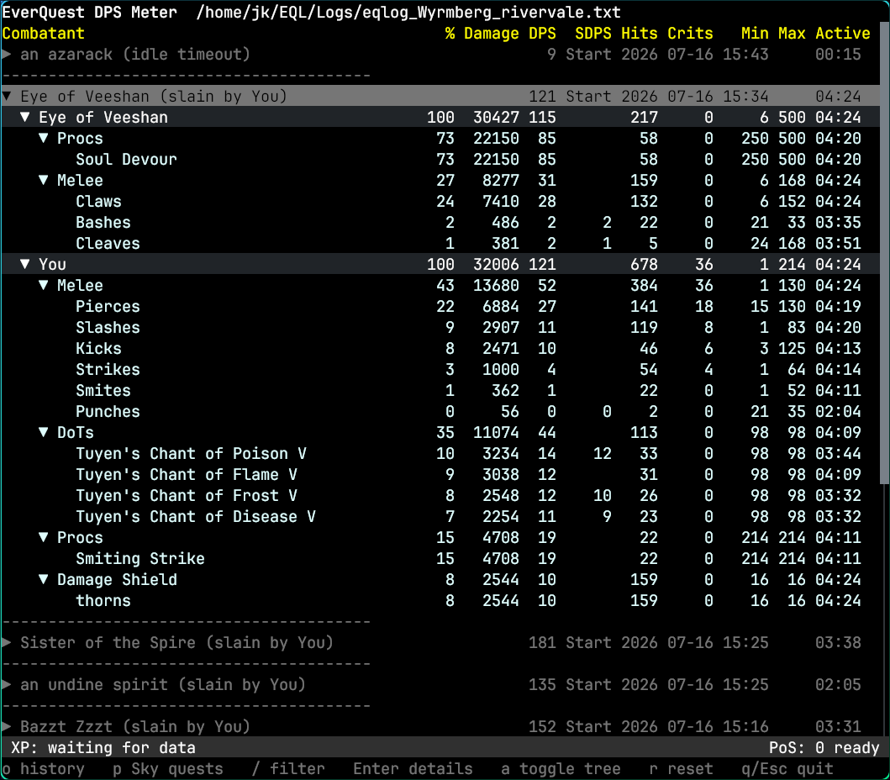
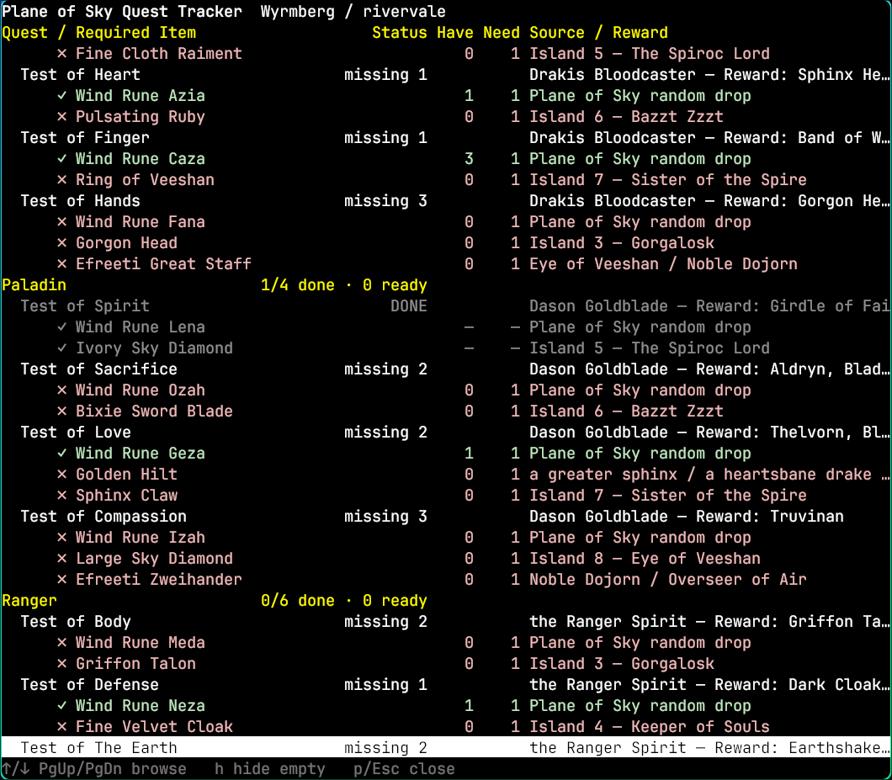

# eqdps

`eqdps` is a DPS meter built primarily for **EverQuest Legends** log files. It
provides independent terminal and graphical frontends backed by the same combat,
experience, loot, and quest parsers. Other EverQuest variants may work where
their log formats overlap, but they are not the project's main compatibility
target.

It tails an EQ log, tracks every engaged mob independently, and can replay
recent history to compare parses or investigate combat detection.

`Because I am lazy and wanted to play EverQuest Legends Open Beta, Codex did most of the work.`

**Terminal DPS screen**



**Plane of Sky tracker**



## Features

- Live EverQuest log tailing
- Terminal and graphical frontends with separate dependency graphs
- Concurrent active-mob and completed-mob history display
- Independent mob endings from death, player death, and idle timeout
- Player, pet, mob, spell, proc, DoT, and damage-shield parsing
- Per-mob combatant rows with DPS/SDPS, hits, crits, min/max, and active time
- Session XP percentage and XP/hour with long pauses excluded
- Expandable details grouped by melee, cast magic, proc, DoT, and shield
- History replay and mob-name filtering
- EverQuest Legends Plane of Sky quest inventory and completion tracking
- Compact graphical DPS overlay
- Plain-text output mode for parser comparisons

## Installation

Clone the repository first:

```bash
git clone https://github.com/uija/eqdps.git
cd eqdps
```

### Terminal Frontend

The terminal frontend has no graphical toolkit dependencies:

```bash
go build -o eqdps ./tui
```

### Graphical Frontend

The graphical frontend uses Gio and requires native window-system development
libraries on Linux.

#### Fedora Build Dependencies

Install Go and the libraries required to compile Gio:

```bash
sudo dnf install golang
sudo dnf install gcc pkgconf-pkg-config libxkbcommon-devel wayland-devel vulkan-loader-devel libX11-devel libglvnd-devel libxkbcommon-x11-devel libXcursor-devel libXfixes-devel
```

Then build the GUI from the repository root:

```bash
go build -o eqdps-gui ./gui
```

## Terminal Frontend

### Running the TUI

Run the built application with an EverQuest logfile:

```bash
./eqdps /path/to/eqlog_character_server.txt
```

From a source checkout, it can be run without building first:

```bash
go run ./tui /path/to/eqlog_character_server.txt
```

### Hotkeys

| Key | Action |
| --- | --- |
| `o` | Open the history menu, including a full-log replay |
| `p` | Open the Plane of Sky quest tracker |
| `/` | Filter displayed fights by mob name |
| `Enter` | Expand or collapse a mob, combatant, or detail category |
| `a` | Fully expand or collapse the selected subtree |
| `r` | Reset combat and session XP meters |
| `q` / `Esc` | Quit |

### History and Replay

The in-app history menu offers Now, 1h, 4h, 8h, 1d, and Full. After loading
history, press `/` and enter a case-insensitive mob-name substring to compare
matching fights. Submit an empty filter to show every fight again.

Seed the TUI with recent history before continuing live:

```bash
./eqdps --back=30 /path/to/log.txt
```

Parse from an exact log timestamp:

```bash
./eqdps --since "2026-07-06 19:22" /path/to/log.txt
```

Show all completed mobs instead of limiting history:

```bash
./eqdps --history=0 --since "2026-07-06 19:22" /path/to/log.txt
```

Print text output instead of opening the TUI:

```bash
./eqdps --text --back=30 /path/to/log.txt
```

### Command-Line Flags

| Flag | Default | Description |
| --- | ---: | --- |
| `--back=N` | `0` | Parse the last `N` minutes before live tailing |
| `--since "YYYY-MM-DD HH:MM"` | empty | Parse from an absolute log timestamp |
| `--history=N` | `0` | Completed mobs to keep and show; `0` keeps all |
| `--idle-timeout=15s` | `15s` | End each mob record after this duration without activity |
| `--text` | `false` | Print text output instead of opening the TUI |

## Graphical Frontend

### Running the GUI

Run the GUI from a source checkout:

```bash
go run ./gui
```

Select a logfile through **File → Open logfile**. The selected logfile and
recent-file list are remembered between launches. Combat history replays and
large Plane of Sky catch-ups show cancellable progress.

**Combat → Reset session** clears the current combat and XP session and resumes
at the end of the selected logfile. The default combat idle timeout is 15
seconds and can be changed under **Tools → Preferences**. Main-window and DPS
overlay sizes are restored; screen placement remains controlled by the window
manager.

### DPS Overlay

Open the compact current-fight window through **View → Show DPS overlay**.
Its visible or hidden state is remembered between launches. The overlay follows
the mob most recently attacked directly by `You`, remains independent of main
window visibility, and clears after the configured combat idle timeout.

The small handle in the top-right corner moves the borderless overlay. Native
always-on-top, opacity, and placement support varies by desktop environment.
The overlay window always uses this stable title for compositor rules:

```text
eqdps — Current Fight
```

### Wayland and Desktop-Environment Setup

Wayland compositors decide whether windows float, stay above other windows,
use opacity, and receive a specific screen position. An application cannot
request those behaviors portably. eqdps explains this once when the overlay is
first opened on Wayland; the information remains available under **Help →
Wayland overlay setup**.

#### Hyprland

For Hyprland 0.55 and newer, add this rule to
`~/.config/hypr/hyprland.lua`:

```lua
hl.window_rule({
    name = "eqdps-overlay",
    match = { title = "^eqdps — Current Fight$" },
    float = true,
    pin = true,
    no_initial_focus = true,
    persistent_size = true,
    move = {100, 100},
    opacity = "0.75 override 0.75 override 0.75 override",
})
```

Change `move` and `opacity` to taste. The coordinates are monitor-local.
Hyprland persists the floating size, while the rule supplies a stable position.

#### KDE Plasma

KDE Plasma includes Window Rules as a standard feature. Open the DPS overlay,
right-click its title bar, and enable **Keep Above Others**. Under **More
Actions**, enable **No Titlebar and Frame** after placing the window where you
want it. The internal drag handle remains available after decorations are
removed.


To make the behavior persistent, choose **More Actions → Configure Special
Window Settings** before removing the title bar. Match the exact title `eqdps —
Current Fight`, add the **Layer** property, and set it to **Force → Overlay**.


#### GNOME

Focus the DPS overlay, press `Alt+Space`, and select **Always on Top**. GNOME
normally applies this only to the current window instance, so it must be
enabled again after the overlay or application is restarted.

A persistent GNOME Shell extension solution is still being tested and is not
currently recommended because it does not yet work reliably.

#### Sway

Match the title `eqdps — Current Fight` with a `for_window` rule and enable the
desired floating and sticky behavior through the compositor configuration.

## Plane of Sky Quest Tracker

The Plane of Sky tracker supports the EverQuest Legends class-unlock system.
It watches Plane of Sky loot, records required class-quest components, shows
what is owned and missing, and highlights quests ready to hand in. Completed
turn-ins are detected from their item, rune, quest-giver, and reward messages
and are marked done in the checklist.

In the TUI, press `p` to open the tracker and `h` to hide quests for which no
required component has been collected. In the GUI, open the **SKY** workspace
or click the `PoS: N ready` status segment. Both frontends briefly highlight the
status area when newly looted items make another quest ready.

The quest database is embedded in the executable, so no separate database file
is required. Character progress remains separate in
`CHARACTER_SERVER_PoS.json` beside the logfile. On first use, the app asks
before scanning existing history. Later launches resume from the saved byte
offset and catch up missed loot and turn-ins. Loot is counted only while the
character is in Plane of Sky, including numbered and adaptive instances.

By default, live combat starts at the current end of the logfile and parses only
new combat lines. Once Plane of Sky tracking is enabled, its saved checkpoint is
caught up independently. Backlogs larger than 5 MiB show progress; the TUI can
cancel with `Esc`, and the GUI provides a **Cancel** action.

## Parser Behavior

### Session XP Rate

The information bar shows progress in the current level, average XP/hour,
estimated time until the next level, and the number of ready Plane of Sky
turn-ins. Progress resets when a level-up is observed, and the paired XP award
from the dinging kill is not counted in the new level.

When the app starts partway through a level, progress is prefixed with `~`
because the log does not reveal the character's starting XP bar. ETA also uses
`~` because it is a projection. XP comes from `You gain experience! (N.NNN%)`
log messages.

XP/hour continues across level-ups and covers the full period since startup,
replay cutoff, history reload, or the last reset. Ordinary combat and pull time
counts toward the average. When combat activity stops for more than one minute,
only the first minute of that idle period counts, keeping travel and longer
breaks from depressing the session rate.

### Per-Mob Combat Tracking

Each hostile mob has an independent record. Outgoing damage is assigned to its
target; incoming damage is assigned to its hostile source. Learned player and
mob roles handle group combat where the local player is not involved in every
event.

Several mobs can remain active simultaneously. AoE, riposte, damage-shield, and
DoT events update the mob they affect without changing another mob's lifecycle.
A mob's death closes only its own record. Local-player death closes all active
mobs, and inactivity closes each idle mob independently.

`Your enemies have forgotten you!` closes every visible fight immediately.
Those completed records remain available for attributable lingering DoTs. Each
DoT tick renews an eight-second retention window without reopening combat; a
later non-DoT event involving that mob starts a new fight immediately.

Recognizable `<owner> pet` damage is included in the owner's mob record, while
a pet death does not close a living owner's record. Damage at the same timestamp
as a mob's death remains with that mob. Later same-name DoTs are buffered for up
to eight seconds: a later non-DoT confirms a new spawn and receives the buffered
DoTs; otherwise they return to the completed mob when the grace period expires.

Every player who damages a mob appears in that mob's section; there is no player
limit. DPS uses the combatant or ability's active interval, while deliberate
engagement supplies the local player's SDPS interval. SDPS uses the shared mob
duration and is hidden when it is within ten percent of DPS.

## Development

Project documentation:

- [GUI roadmap](docs/GUI_ROADMAP.md)
- [Parser recheck guide](docs/PARSER_RECHECK.md)
- [Project context and engineering handoff](docs/PROJECT_CONTEXT.md)

Run all shared, terminal, and graphical tests:

```bash
go test ./...
go test ./tui/...
go test ./gui/...
```

## Thank Yous

Big thank you to my Guild **Side Gigg** on Rivervale. Also many many thanks to
**Karthar** for providing test data, testing the application, giving feedback,
providing KDE fixes and beeing awesome during the development.

## License

MIT
