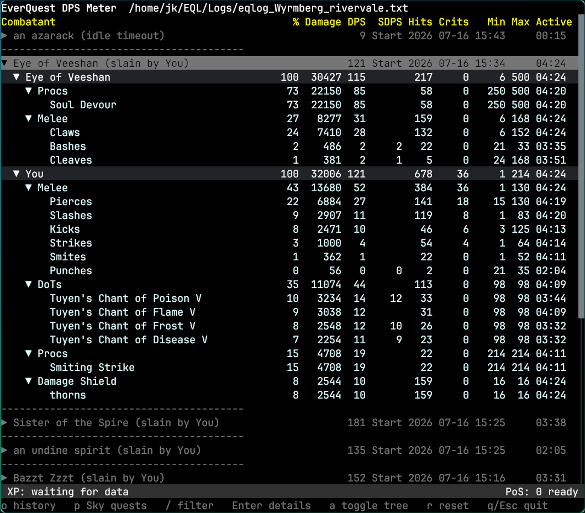
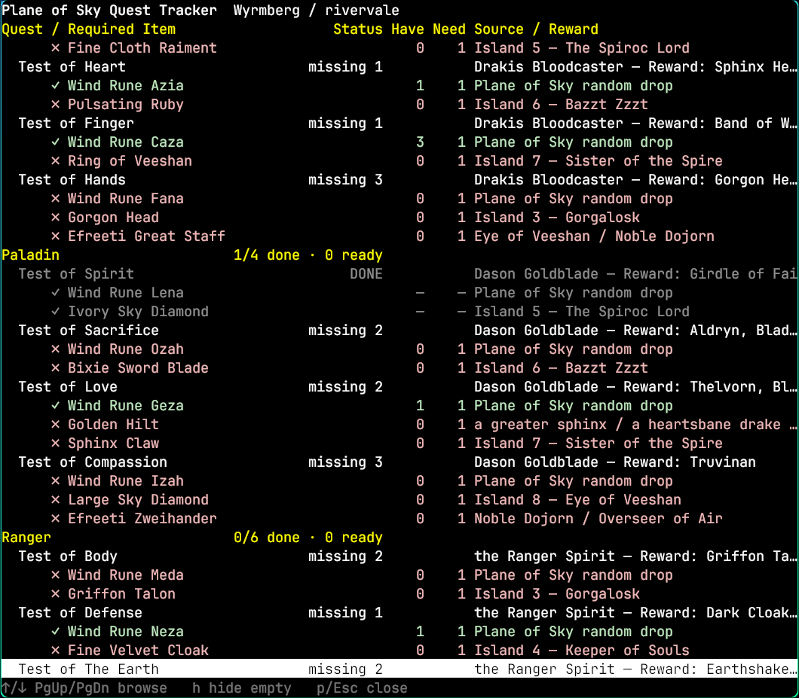
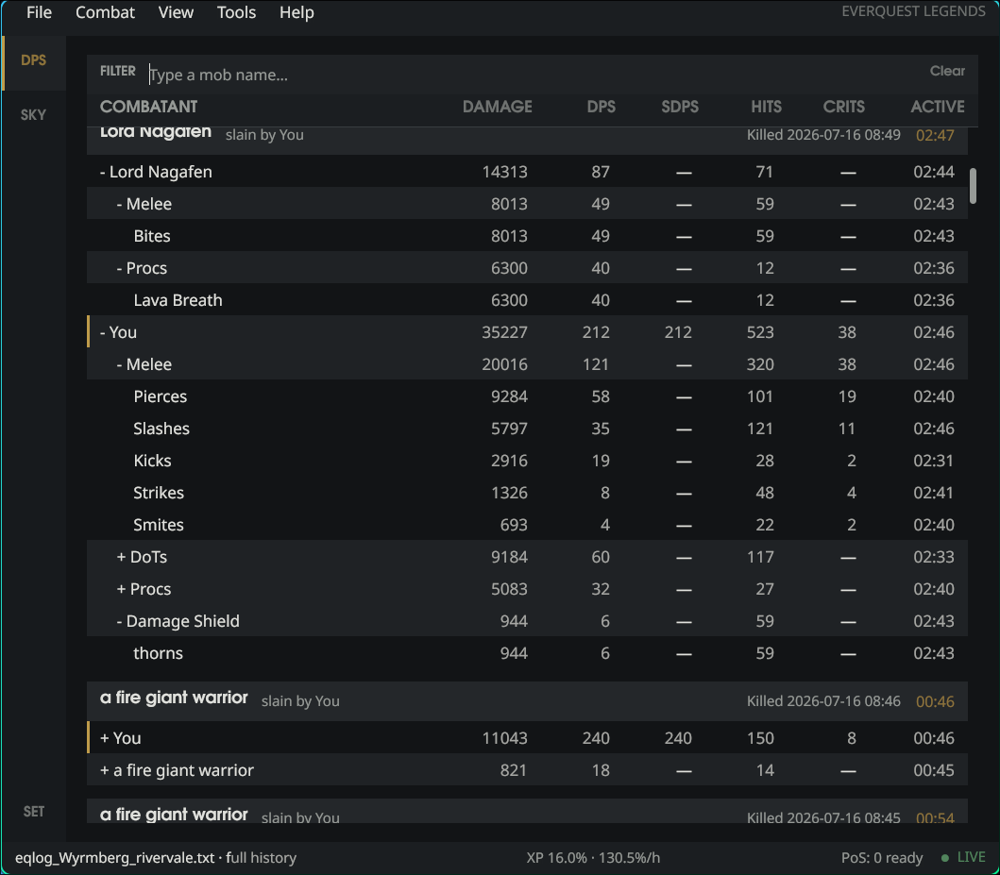
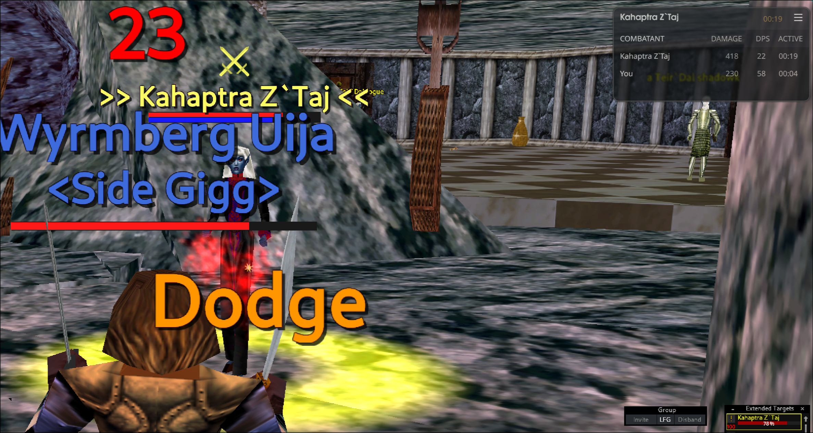
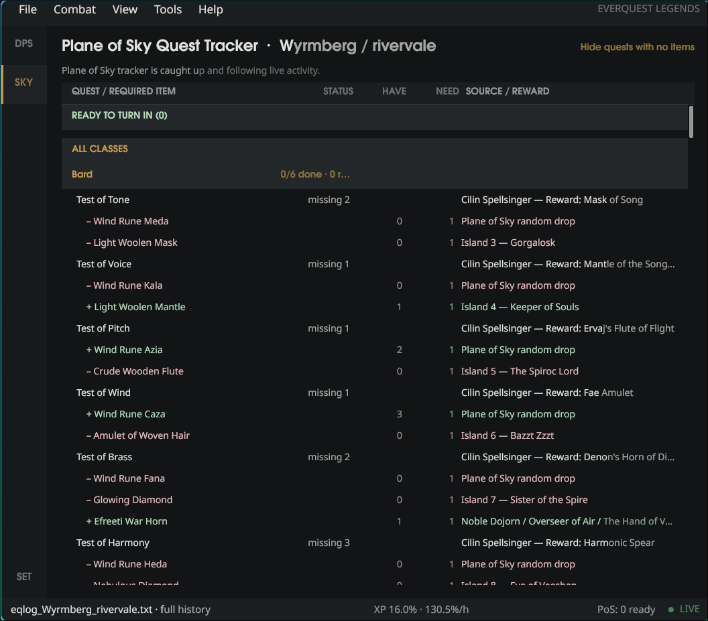

# eqdps

`eqdps` is a DPS meter built primarily for **EverQuest Legends** log files. It
provides independent terminal and graphical frontends backed by the same combat,
experience, loot, and quest parsers. Other EverQuest variants may work where
their log formats overlap, but they are not the project's main compatibility
target.

It tails an EQ log, tracks every engaged mob independently, and can replay
recent history to compare parses or investigate combat detection.

> Because I am lazy and wanted to play the EverQuest Legends Open Beta, Codex
> did most of the work.

## Download

Windows users can download the prebuilt graphical application directly from
the [eqdps v0.2.2b release](https://github.com/uija/eqdps/releases/tag/v0.2.2b).

The Windows executables are not currently code-signed. Microsoft Defender
SmartScreen may therefore display an **Unknown publisher** warning. Download
builds only from the official release page.

Linux users currently need to [build from source](#building-from-source).

## Screenshots

`eqdps` can run as a compact terminal application or as a graphical desktop
application. The screenshots below show the main combat views, the optional
in-game DPS overlay, and the Plane of Sky quest tracker in both interfaces.

### Terminal DPS screen



### Terminal Plane of Sky tracker



### Windowed DPS screen



### Windowed DPS overlay



### Windowed Plane of Sky tracker



## Features

- Live EverQuest log tailing
- Terminal and graphical frontends
- Concurrent active-mob and completed-mob history display
- Independent mob endings from death, player death, and idle timeout
- Player, pet, mob, spell, proc, DoT, and damage-shield parsing
- Per-mob combatant rows with DPS/SDPS, hits, crits, min/max, and active time
- Session XP percentage and XP/hour with long pauses excluded
- Expandable details grouped by melee, cast magic, proc, DoT, and shield
- History replay and mob-name filtering
- EverQuest Legends Plane of Sky quest inventory and completion tracking
- Configurable spell-fade, text, exact-text, and regular-expression events
- Cross-platform desktop notifications with selectable EverQuest spell-icon sets
- Embedded and user-provided notification sounds with shared volume control
- Optional EQLDB inventory-export uploads from both frontends
- Optional EQLDB contribution of player-related kills and personal loot for drop statistics
- Compact graphical DPS overlay with font, opacity, and idle-timeout preferences
- Plain-text output mode for parser comparisons

## Terminal Frontend

### Running the TUI

Run the built application with an EverQuest logfile:

```bash
./eqdps /path/to/eqlog_character_server.txt
```

From a source checkout, it can be run without building first:

```bash
go run ./tui /path/to/eqlog_character_server.txt
```

### Hotkeys

| Key | Action |
| --- | --- |
| `o` | Open the history menu, including a full-log replay |
| `p` | Open the Plane of Sky quest tracker |
| `n` | Open the Events page |
| `e` | Open EQLDB connection management |
| `s` | Open shared settings, including kill and loot collection |
| `/` | Filter displayed fights by mob name |
| `Enter` | Expand or collapse a mob, combatant, or detail category |
| `a` | Fully expand or collapse the selected subtree |
| `r` | Reset combat and session XP meters |
| `q` / `Esc` | Quit |

### Command-Line Flags

| Flag | Default | Description |
| --- | ---: | --- |
| `--back=N` | `0` | Parse the last `N` minutes before live tailing |
| `--since "YYYY-MM-DD HH:MM"` | empty | Parse from an absolute log timestamp |
| `--history=N` | `0` | Completed mobs to keep and show; `0` keeps all |
| `--idle-timeout=15s` | `15s` | End each mob record after this duration without activity |
| `--text` | `false` | Print text output instead of opening the TUI |

## Events and Notifications

Open **EVENTS** in the GUI left rail or press `n` from the TUI DPS screen. The
shared Events workspace supports spell-fade, plain-text, exact-text, and
regular-expression triggers. Each event can independently show a desktop
notification, play a sound, or do both. Notifications can request persistent
display, although the desktop environment controls the final behavior.

The TUI Events page uses these scoped keys:

| Key | Events action |
| --- | --- |
| `a` | Activate or deactivate the selected event |
| `Enter` | Edit the selected event |
| `d` | Delete the selected event |
| `s` | Add a spell-fade event |
| `t` | Add a text event |
| `r` | Add a regular-expression event |
| `v` | Open Event settings for sound volume and spell-icon style |
| `i` | Run spell-icon setup manually |
| `q` / `Esc` | Return to the DPS screen |

Only genuinely new logfile lines trigger events. History replay, Plane of Sky
initial scans, and checkpoint catch-up never play sounds or display desktop
notifications.

The GUI provides the same event editors, a 0–100% master volume slider, and a
spell-icon style selector. The TUI exposes both options through `v`; while its
volume field is focused, the arrow keys adjust it by 5%. Both frontends use one
event configuration, volume, and selected icon style. Copy MP3 or WAV files
into the event `audio/` directory described under
[Configuration and Data](#configuration-and-data), then reopen Events to make
them available in the sound selector.

When Events is first opened with a logfile selected, eqdps can extract every
distinct spell-icon set from the associated EverQuest installation. Effective
duplicates from inherited or copied UI folders are extracted only once. Each
set is stored below a subdirectory named after the first UI folder containing
it, such as `default` or `default_modern`. Declining suppresses future automatic
prompts; extraction remains available manually.

## History and Replay

Both frontends can load Now, 1h, 4h, 8h, 1d, or Full history. In the TUI, press
`o`; in the GUI, use **Combat → Load history**. Filtering accepts a
case-insensitive mob-name substring, and an empty query shows every fight
again.

Seed the TUI with recent history before continuing live:

```bash
./eqdps --back=30 /path/to/log.txt
```

Parse from an exact log timestamp:

```bash
./eqdps --since "2026-07-06 19:22" /path/to/log.txt
```

Show all completed mobs instead of limiting history:

```bash
./eqdps --history=0 --since "2026-07-06 19:22" /path/to/log.txt
```

Print text output instead of opening the TUI:

```bash
./eqdps --text --back=30 /path/to/log.txt
```

## EQLDB Inventory Uploads

Both frontends can connect to [EQLDB](https://eqldb.org/) and upload an
EverQuest Legends inventory export when `/outputfile inventory` completes.
Press `e` in the TUI or use **Tools → EQLDB connection** in the GUI to connect
or manage the connection. Authentication happens in the browser through a
short-lived device code; no EQLDB password is entered into eqdps.

For automatic level, class, and race detection, use a game macro containing:

```text
/who CHARACTERNAME
/outputfile inventory
```

The matching `/who` result must be no more than one minute older than the
export. Without one, the active frontend asks for the metadata before
uploading. Every race reported by `/who`, including an unknown race or active
illusion, is sent to EQLDB for server-side classification.

EverQuest writes the logfile below `Logs/` and the inventory beside that
directory:

```text
EverQuest Legends/
├── Logs/
│   └── eqlog_CHARACTER_SERVER.txt
└── CHARACTER_SERVER-Inventory.txt
```

Repeated export messages within two seconds are combined into one upload.
After an upload begins, a shared 15-second cooldown prevents accidental
duplicate uploads, including when more than one eqdps process is running.

The token grants `inventory:upload`, `plane-of-sky:write`, and
`observations:write`; it can be revoked from the Connected apps section of the
EQLDB account. Connections created before the event scopes were introduced
must be removed and connected again before parser events can upload.

Kill and personal-loot collection is a separate, explicit opt-in. Enable it
under **SET** in the GUI or with `s` in the TUI. eqdps keeps a logfile byte
checkpoint, catches up activity missed while the application was closed, and
does not collect activity from before opt-in or while disabled. Combat history
reloads do not duplicate observations. Pending observations are uploaded in
batches while EQLDB is connected and remain queued after temporary failures.
Plane of Sky rune receipts, direct rune deletions, and completed quest hand-ins
are queued automatically whenever Plane of Sky tracking is enabled.

## Configuration and Data

Shared application data is stored in the platform's `eqdps` user-configuration
directory:

| Platform | Default directory |
| --- | --- |
| Linux | `$XDG_CONFIG_HOME/eqdps` or `~/.config/eqdps` |
| Windows | `%AppData%\eqdps` |
| macOS | `~/Library/Application Support/eqdps` |

The directory contains:

| Path | Purpose |
| --- | --- |
| `events.json` | Event definitions shared by both frontends |
| `events-settings.json` | Master sound volume, icon setup, and selected icon set |
| `audio/` | User-provided MP3 and WAV notification sounds |
| `spell-icons/<UI name>/` | Extracted spell icons grouped by distinct UI set |
| `eqldb.json` | Shared EQLDB connection and introduction state |
| `drop-collection-settings.json` | Shared kill and loot collection opt-in |
| `drop-collection/` | Per-logfile kill and loot collection checkpoints |
| `eqldb-queue/` | Pending Plane of Sky, kill, and drop upload batches |
| `gui.json` | GUI preferences, recent logs, and window state |

Plane of Sky progress is character-specific and remains in
`CHARACTER_SERVER_PoS.json` beside the selected logfile. Event and EQLDB writes
are protected against concurrent eqdps processes.

## Graphical Frontend

### Running the GUI

Run the GUI from a source checkout:

```bash
go run ./gui
```

Select a logfile through **File → Open logfile**. The selected logfile and
recent-file list are remembered between launches. Combat history replays and
large Plane of Sky catch-ups show cancellable progress.

Use the **DPS**, **SKY**, **EVENTS**, and **SET** workspaces in the left rail.
The same destinations are available from the **View** and **Tools** menus.
Class, spell, and sound selectors in the Events editor remain bounded inside
the scrolling workspace.

**Combat → Reset session** clears the current combat and XP session and resumes
at the end of the selected logfile. The default combat idle timeout is 15
seconds and can be changed under **Tools → Preferences**. Preferences also
control main-window font scale, DPS-overlay font scale, and overlay opacity.
Main-window and DPS-overlay sizes are restored between launches.

Use **Tools → EQLDB connection** to connect or manage automatic inventory
uploads. Detection notifications appear temporarily in the bottom status bar.

### DPS Overlay

Open the compact current-fight window through **View → Show DPS overlay**.
Its visible or hidden state is remembered between launches. The overlay follows
the mob most recently attacked directly by `You`, remains independent of main
window visibility, and clears after the configured combat idle timeout.

The small handle in the top-right corner moves the borderless overlay. On
Windows, eqdps applies native always-on-top behavior and remembers overlay
opacity, size, and position. On Linux, these behaviors vary by desktop
environment.
The overlay window always uses this stable title for compositor rules:

```text
eqdps — Current Fight
```

### Wayland and Desktop-Environment Setup

Wayland compositors decide whether windows float, stay above other windows,
use opacity, and receive a specific screen position. An application cannot
request those behaviors portably. eqdps explains this once when the overlay is
first opened on Wayland; the information remains available under **Help →
Wayland overlay setup**.

#### Hyprland

For Hyprland 0.55 and newer, add this rule to
`~/.config/hypr/hyprland.lua`:

```lua
hl.window_rule({
    name = "eqdps-overlay",
    match = { title = "^eqdps — Current Fight$" },
    float = true,
    pin = true,
    no_initial_focus = true,
    persistent_size = true,
    move = {100, 100},
    opacity = "0.75 override 0.75 override 0.75 override",
})
```

Change `move` and `opacity` to taste. The coordinates are monitor-local.
Hyprland persists the floating size, while the rule supplies a stable position.

#### KDE Plasma

KDE Plasma includes Window Rules as a standard feature. Open the DPS overlay,
right-click its title bar, and enable **Keep Above Others**. Under **More
Actions**, enable **No Titlebar and Frame** after placing the window where you
want it. The internal drag handle remains available after decorations are
removed.


To make the behavior persistent, choose **More Actions → Configure Special
Window Settings** before removing the title bar. Match the exact title `eqdps —
Current Fight`, add the **Layer** property, and set it to **Force → Overlay**.


#### GNOME

Focus the DPS overlay, press `Alt+Space`, and select **Always on Top**. GNOME
normally applies this only to the current window instance, so it must be
enabled again after the overlay or application is restarted.

A persistent GNOME Shell extension solution is still being tested and is not
currently recommended because it does not yet work reliably.

#### Sway

Match the title `eqdps — Current Fight` with a `for_window` rule and enable the
desired floating and sticky behavior through the compositor configuration.

## Plane of Sky Quest Tracker

The Plane of Sky tracker supports the EverQuest Legends class-unlock system.
It watches Plane of Sky loot, records required class-quest components, shows
what is owned and missing, and highlights quests ready to hand in. Completed
turn-ins are detected from their item, rune, quest-giver, and reward messages
and are marked done in the checklist.

In the TUI, press `p` to open the tracker and `h` to hide quests for which no
required component has been collected. In the GUI, open the **SKY** workspace
or click the `PoS: N ready` status segment. Both frontends briefly highlight the
status area when newly looted items make another quest ready.

The quest database is embedded in the executable, so no separate database file
is required. Character progress remains separate in
`CHARACTER_SERVER_PoS.json` beside the logfile. On first use, the app asks
before scanning existing history. Later launches resume from the saved byte
offset and catch up missed loot and turn-ins. Loot is counted only while the
character is in Plane of Sky, including numbered and adaptive instances.

By default, live combat starts at the current end of the logfile and parses only
new combat lines. Once Plane of Sky tracking is enabled, its saved checkpoint is
caught up independently. Backlogs larger than 5 MiB show progress; the TUI can
cancel with `Esc`, and the GUI provides a **Cancel** action.

## Parser Behavior

### Session XP Rate

The information bar shows progress in the current level, average XP/hour,
estimated time until the next level, and the number of ready Plane of Sky
turn-ins. Progress resets when a level-up is observed, and the paired XP award
from the dinging kill is not counted in the new level.

When the app starts partway through a level, progress is prefixed with `~`
because the log does not reveal the character's starting XP bar. ETA also uses
`~` because it is a projection. XP comes from `You gain experience! (N.NNN%)`
log messages.

XP/hour continues across level-ups and covers the full period since startup,
replay cutoff, history reload, or the last reset. Ordinary combat and pull time
counts toward the average. When combat activity stops for more than one minute,
only the first minute of that idle period counts, keeping travel and longer
breaks from depressing the session rate.

### Per-Mob Combat Tracking

Each hostile mob has an independent record. Outgoing damage is assigned to its
target; incoming damage is assigned to its hostile source. Learned player and
mob roles handle group combat where the local player is not involved in every
event.

Several mobs can remain active simultaneously. AoE, riposte, damage-shield, and
DoT events update the mob they affect without changing another mob's lifecycle.
A mob's death closes only its own record. Local-player death closes all active
mobs, and inactivity closes each idle mob independently.

`Your enemies have forgotten you!` closes every visible fight immediately.
Those completed records remain available for attributable lingering DoTs. Each
DoT tick renews an eight-second retention window without reopening combat; a
later non-DoT event involving that mob starts a new fight immediately.

Recognizable `<owner> pet` damage is included in the owner's mob record, while
a pet death does not close a living owner's record. Damage at the same timestamp
as a mob's death remains with that mob. Later same-name DoTs are buffered for up
to eight seconds: a later non-DoT confirms a new spawn and receives the buffered
DoTs; otherwise they return to the completed mob when the grace period expires.

Every player who damages a mob appears in that mob's section; there is no player
limit. DPS uses the combatant or ability's active interval, while deliberate
engagement supplies the local player's SDPS interval. SDPS uses the shared mob
duration and is hidden when it is within ten percent of DPS.

## Building from Source

Clone the repository first:

```bash
git clone https://github.com/uija/eqdps.git
cd eqdps
```

### Fedora Build Dependencies

Install Go and the libraries required to compile Gio:

```bash
sudo dnf install golang make
sudo dnf install gcc pkgconf-pkg-config libxkbcommon-devel wayland-devel vulkan-loader-devel libX11-devel libglvnd-devel libxkbcommon-x11-devel libXcursor-devel libXfixes-devel
```

The TUI-only target needs Go and Make but does not need the Gio libraries.

### Ubuntu, Debian, and Mint Build Dependencies

Install Go, Make, and the libraries required to compile Gio:

```bash
sudo apt install \
    golang-go \
    make \
    gcc \
    pkg-config \
    libxkbcommon-dev \
    libwayland-dev \
    libvulkan-dev \
    libx11-dev \
    libx11-xcb-dev \
    libglvnd-dev \
    libxkbcommon-x11-dev \
    libxcursor-dev \
    libxfixes-dev \
    build-essential
```

As on Fedora, the TUI-only target does not need the Gio development libraries.

### Build with Make

The supported source-build workflow uses the repository Makefile. Build both
Linux frontends into `dist/`:

```bash
make
```

Build only one frontend when needed:

```bash
make gui
make tui
```

The terminal frontend has no graphical toolkit dependencies. The graphical
frontend uses Gio and requires native window-system development libraries on
Linux.

Install both Linux frontends, the application-menu entry, and the scalable icon
system-wide:

```bash
sudo make install
```

For an installation below the current user's `~/.local` directory instead:

```bash
make install PREFIX=~/.local
```

Remove the files with the same installation prefix:

```bash
sudo make uninstall
make uninstall PREFIX=~/.local
```

Other useful targets are `make test`, `make clean`, and `make windows`. The
Windows target creates stripped amd64 GUI and TUI executables in `dist/` without
changing the host Go environment or requiring MinGW or Clang.

### Manual Builds

The equivalent direct Go commands remain available when Make is unavailable.
Build the Linux frontends manually from the repository root:

```bash
go build -o eqdps-gui ./gui
go build -o eqdps ./tui
```

Cross-compile stripped Windows amd64 executables manually:

```bash
GOOS=windows GOARCH=amd64 CGO_ENABLED=0 go build -trimpath -ldflags="-s -w -H=windowsgui" -o eqdps-gui-windows-amd64.exe ./gui
GOOS=windows GOARCH=amd64 CGO_ENABLED=0 go build -trimpath -ldflags="-s -w" -o eqdps-tui-windows-amd64.exe ./tui
```

## Plane of Sky Data Attribution

The embedded Plane of Sky quest dataset in
`internal/skyquest/plane_of_sky_quests.json` is derived from the
[Plane of Sky class-quest data](https://eqlwiki.com/Plane_of_Sky#Plane_of_Sky_Class_Quests)
and related class and item pages maintained by the
[EQL Wiki contributors](https://eqlwiki.com/). The imported information includes
quest names, quest givers, required items, rewards, and item sources. It has
been extracted into structured JSON, normalized, and supplemented with
corrections observed in EverQuest Legends logs.

EQL Wiki states in its
[general disclaimer and copyright notice](https://eqlwiki.com/EQLWiki%3AGeneral_disclaimer)
that its content is available under the
[Creative Commons Attribution-ShareAlike 4.0 International license](https://creativecommons.org/licenses/by-sa/4.0/)
unless otherwise noted. The EQL Wiki-derived dataset and adaptations of that
data are therefore provided under CC BY-SA 4.0. The application source code
remains licensed under MIT.

## Thanks

A big thank you to my guild **Side Gigg** on Rivervale, and many thanks to
**Karthar** for providing test data, testing the application, giving feedback,
providing the KDE fixes, and being awesome throughout development.

## License

The application source code is licensed under the MIT License. The embedded
EQL Wiki-derived Plane of Sky dataset is licensed under CC BY-SA 4.0 as
described above.

The embedded notification sounds are provided under CC0 1.0 and are described
in [Third-Party Notices](docs/THIRD_PARTY_NOTICES.md).
